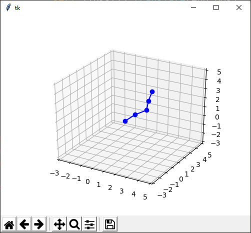
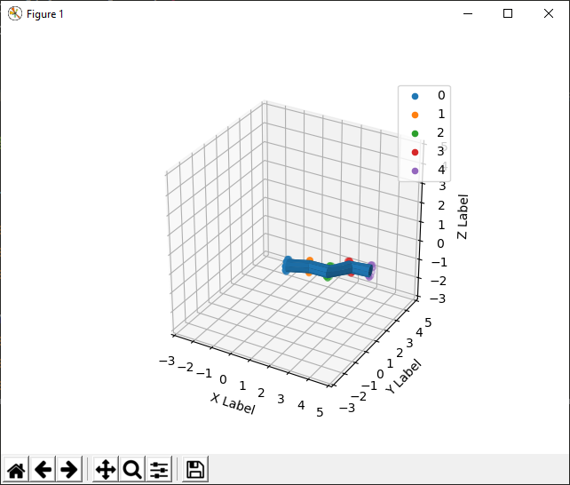

# Forward-Kinematics
Practical application of forward kinematics.

These two scripts apply matrix methods, through object oriented programming, to make moving chains and tentacles. The paradigm of this project is that chains and tentacles are objects themselves, made out of links and rings, respectively, which are objects too.

Below you can see an example of a chain.

Below you can see an example of a tentacle.

This is work in progress.
