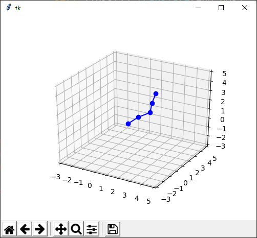
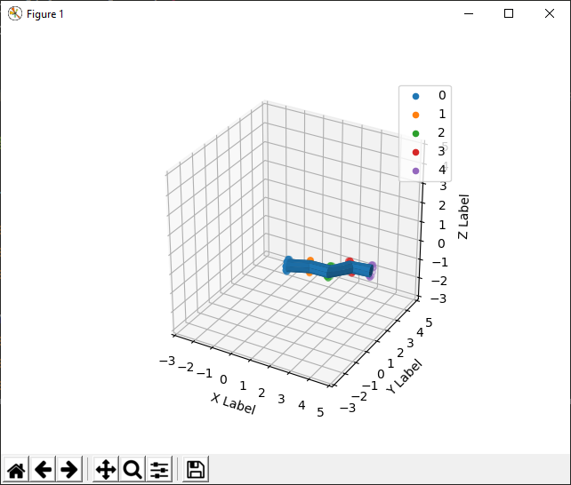

# Forward-Kinematics
Practical application of forward kinematics





To incorporate this add-on widget simply import the module and place as many gauges as you wish into tkinter frames.
Because object-oriented programming was used, this code is versatile in handling the multiplte gauge instances.

```python
import tkinter as tk 
from tkGauge import *
import random
```
